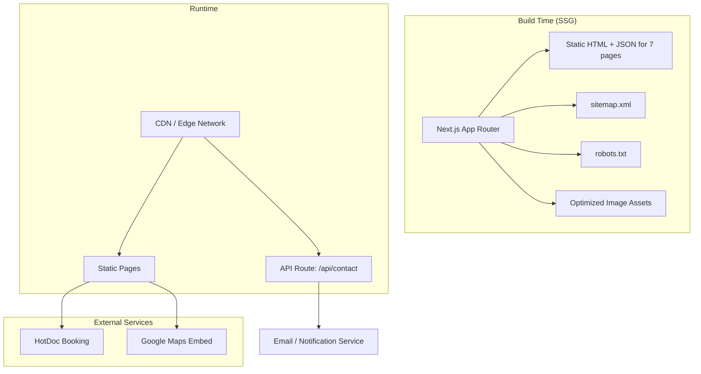
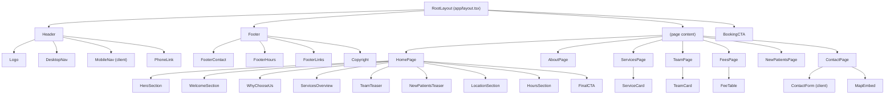

# Design Document: IMC Clinic Website

## Overview

This design describes the architecture and implementation of the Infinity Medical Centre (IMC) Gungahlin website — a 7-page, statically generated Next.js application styled with Tailwind CSS. The site serves as the clinic's primary digital presence, providing patients with information about services, team, fees, and enabling appointment bookings via HotDoc.

The primary technical goals are:
- Fast page loads via Static Site Generation (SSG) for all routes
- Strong SEO through structured data (JSON-LD), metadata, sitemap, and Core Web Vitals optimization
- Responsive, accessible design across mobile, tablet, and desktop viewports
- A persistent booking CTA for frictionless appointment scheduling

The site targets deployment on Vercel or Netlify with zero custom server configuration.

## Architecture

### High-Level Architecture



### Routing Structure

All pages use the Next.js App Router file-based routing convention:

| Route | Page | File Path |
|-------|------|-----------|
| `/` | Home | `app/page.tsx` |
| `/about` | About Us | `app/about/page.tsx` |
| `/services` | Services | `app/services/page.tsx` |
| `/our-team` | Our Team | `app/our-team/page.tsx` |
| `/fees` | Fees & Billing | `app/fees/page.tsx` |
| `/new-patients` | New Patients | `app/new-patients/page.tsx` |
| `/contact` | Contact Us | `app/contact/page.tsx` |

### Rendering Strategy

All 7 pages are statically generated at build time. No `"use client"` directive is needed on page-level components except for interactive elements (mobile nav toggle, contact form). The contact form submission hits a Next.js API route (`app/api/contact/route.ts`) which is the only server-side runtime endpoint.

### Design Decisions

1. **App Router over Pages Router**: App Router is the current Next.js standard, supports React Server Components, and provides built-in metadata API for SEO.
2. **SSG for all pages**: Clinic content is static — no user-specific or frequently changing data. SSG gives the best performance and SEO characteristics.
3. **Tailwind CSS**: Utility-first approach eliminates unused CSS via purging, keeps bundle size minimal, and enables rapid responsive design.
4. **Client components only where needed**: Mobile nav toggle and contact form require interactivity. Everything else renders as server components to minimize client JS.
5. **Content in data files**: Clinic content (services, team bios, fees, hours) is stored in TypeScript data files rather than a CMS, matching the static nature of the site.

## Components and Interfaces

### Component Hierarchy



### Shared Components

| Component | Type | Props | Description |
|-----------|------|-------|-------------|
| `Header` | Server | — | Logo, nav links, phone number. Contains `MobileNav` client child. |
| `MobileNav` | Client | `links: NavLink[]` | Hamburger toggle, slide-out menu. Renders below 768px. |
| `Footer` | Server | — | Contact info, hours, quick links, copyright. |
| `BookingCTA` | Server | — | Fixed-position button linking to HotDoc (opens new tab). |
| `HeroSection` | Server | `headline, subtext, ctaText, ctaHref` | Banner with heading, description, and primary action button. |
| `ServiceCard` | Server | `icon, title, description` | Card displaying a single service category. |
| `TeamCard` | Server | `name, qualifications, specialInterests, photoSrc?` | Card displaying a doctor/staff member. |
| `FeeTable` | Server | `fees: FeeItem[]` | Responsive table of non-Medicare fees. Horizontally scrollable on mobile. |
| `ContactForm` | Client | — | Form with name, phone, email, message fields. Client-side validation + API submission. |
| `MapEmbed` | Server | `src: string` | Google Maps iframe with lazy loading. |
| `SectionHeading` | Server | `title, subtitle?` | Reusable section heading for consistent typography. |

### Page Components

Each page is a default-exported async React Server Component in its respective `app/` directory. Pages import shared components and page-specific data from `lib/data/`.

### API Route

| Endpoint | Method | Request Body | Response |
|----------|--------|-------------|----------|
| `/api/contact` | POST | `{ name: string, phone: string, email: string, message: string }` | `{ success: boolean, error?: string }` |

The API route validates the request body, sanitizes inputs, and forwards the enquiry (e.g., via email service or stored for retrieval). Returns 400 for validation failures, 200 on success, 500 on server error.


### SEO Module

The SEO implementation leverages the Next.js Metadata API:

```typescript
// Each page exports a metadata object or generateMetadata function
export const metadata: Metadata = {
  title: "Page Title | Infinity Medical Centre Gungahlin",
  description: "Page-specific meta description",
  openGraph: {
    title: "...",
    description: "...",
    url: "https://infinitymedicalcentre.com.au/page",
    type: "website" | "article",
    images: [{ url: "/og-image.jpg" }],
  },
  alternates: {
    canonical: "https://infinitymedicalcentre.com.au/page",
  },
};
```

Structured data is injected via `<script type="application/ld+json">` in page components:

| Page | Schema Type | Key Fields |
|------|-------------|------------|
| Home | `LocalBusiness` | name, address, telephone, openingHours, geo |
| Services | `MedicalBusiness` | medicalSpecialty (12 categories) |
| Our Team | `Physician` (per doctor) | name, qualifications, medicalSpecialty |

Sitemap and robots.txt use Next.js conventions:
- `app/sitemap.ts` — exports a `sitemap()` function returning all 7 URLs with `lastModified` dates
- `app/robots.ts` — exports a `robots()` function with allow-all rules and sitemap reference

## Data Models

### Navigation

```typescript
interface NavLink {
  label: string;
  href: string;
}

const NAV_LINKS: NavLink[] = [
  { label: "Home", href: "/" },
  { label: "About Us", href: "/about" },
  { label: "Services", href: "/services" },
  { label: "Our Team", href: "/our-team" },
  { label: "Fees & Billing", href: "/fees" },
  { label: "New Patients", href: "/new-patients" },
  { label: "Contact Us", href: "/contact" },
];
```

### Clinic Info

```typescript
interface ClinicInfo {
  name: string;           // "Infinity Medical Centre Gungahlin"
  address: string;        // "Unit 1/63 Anthony Rolfe Avenue, Gungahlin ACT"
  phone: string;          // Clinic phone number
  bookingUrl: string;     // HotDoc booking URL
  openingHours: OpeningHours[];
  geo: { latitude: number; longitude: number };
}

interface OpeningHours {
  days: string;           // e.g. "Monday - Friday"
  hours: string;          // e.g. "8:30am - 5:00pm"
  closed?: boolean;       // true for Sunday
}
```

### Services

```typescript
interface ServiceCategory {
  id: string;
  icon: string;           // Icon identifier (e.g. Lucide icon name)
  title: string;
  description: string;
}
```

### Team

```typescript
interface Doctor {
  id: string;
  name: string;
  qualifications: string[];
  specialInterests: string[];
  photoSrc?: string;
  bio: string;
}
```

### Fees

```typescript
interface FeeItem {
  service: string;
  fee: string;            // e.g. "$150", "AMA Rate", "TBA"
}

const NON_MEDICARE_FEES: FeeItem[] = [
  { service: "Driver's Licence Medical", fee: "$150" },
  { service: "Pre-Employment Medical", fee: "AMA Rate" },
  { service: "Workers Compensation", fee: "AMA Rate" },
  { service: "Insurance Reports", fee: "TBA" },
];
```

### Contact Form

```typescript
interface ContactFormData {
  name: string;
  phone: string;
  email: string;
  message: string;
}

interface ContactFormErrors {
  name?: string;
  phone?: string;
  email?: string;
  message?: string;
}

interface ContactApiResponse {
  success: boolean;
  error?: string;
}
```

### SEO Structured Data

```typescript
interface LocalBusinessSchema {
  "@context": "https://schema.org";
  "@type": "LocalBusiness";
  name: string;
  address: {
    "@type": "PostalAddress";
    streetAddress: string;
    addressLocality: string;
    addressRegion: string;
    addressCountry: string;
  };
  telephone: string;
  openingHoursSpecification: OpeningHoursSpec[];
  geo: {
    "@type": "GeoCoordinates";
    latitude: number;
    longitude: number;
  };
}

interface MedicalBusinessSchema {
  "@context": "https://schema.org";
  "@type": "MedicalBusiness";
  name: string;
  medicalSpecialty: string[];
}

interface PhysicianSchema {
  "@context": "https://schema.org";
  "@type": "Physician";
  name: string;
  qualifications: string;
  medicalSpecialty: string[];
}
```

### Page Metadata

```typescript
interface PageSEO {
  title: string;
  description: string;
  ogType: "website" | "article";
  canonicalPath: string;
}

const PAGE_SEO: Record<string, PageSEO> = {
  home: {
    title: "Infinity Medical Centre Gungahlin | Family GP Clinic",
    description: "Bulk billing family medical centre in Gungahlin, ACT...",
    ogType: "website",
    canonicalPath: "/",
  },
  // ... one entry per page
};
```

## Correctness Properties

*A property is a characteristic or behavior that should hold true across all valid executions of a system — essentially, a formal statement about what the system should do. Properties serve as the bridge between human-readable specifications and machine-verifiable correctness guarantees.*

### Property 1: TeamCard renders all required doctor fields

*For any* valid Doctor object (with non-empty name, at least one qualification, and at least one special interest), rendering a TeamCard with that Doctor SHALL produce output containing the doctor's name, all qualifications, and all special interests.

**Validates: Requirements 6.4**

### Property 2: FeeTable renders all fee items

*For any* non-empty array of FeeItem objects, rendering a FeeTable SHALL produce output containing every service name and every fee value from the input array.

**Validates: Requirements 7.3**

### Property 3: Valid contact form data passes validation

*For any* ContactFormData where name is non-empty, phone matches a valid phone pattern, email matches a valid email pattern, and message is non-empty, the form validation function SHALL return zero errors and the API submission payload SHALL contain the exact same field values as the input.

**Validates: Requirements 9.7**

### Property 4: Missing contact form fields produce per-field validation errors

*For any* subset of ContactFormData fields left empty (at least one field empty), the form validation function SHALL return an error message for each empty field and SHALL NOT return error messages for fields that are validly filled.

**Validates: Requirements 9.8**

### Property 5: Physician JSON-LD generation is correct and structurally valid

*For any* valid Doctor object, the generated Physician JSON-LD schema SHALL contain @context "https://schema.org", @type "Physician", the doctor's name, qualifications string, and medicalSpecialty array, and SHALL conform to Schema.org Physician vocabulary requirements.

**Validates: Requirements 11.3, 11.4**

## Error Handling

### Contact Form Errors

| Error Scenario | Handling Strategy |
|---------------|-------------------|
| Missing required field | Inline validation message below the field. Form is not submitted. |
| Invalid email format | Inline validation message: "Please enter a valid email address." |
| Invalid phone format | Inline validation message: "Please enter a valid phone number." |
| API route returns 500 | Display a generic error banner: "Something went wrong. Please try again or call us directly." |
| Network failure on submit | Display error banner with retry option. Show clinic phone number as fallback. |

### Image Loading Errors

| Error Scenario | Handling Strategy |
|---------------|-------------------|
| Image fails to load | next/image handles fallback. Alt text remains visible. |
| Missing image source | Render a placeholder div with clinic initials or generic icon. |

### Google Maps Embed Errors

| Error Scenario | Handling Strategy |
|---------------|-------------------|
| Maps iframe fails to load | Display static fallback with clinic address text and a link to Google Maps. |

### Build-Time Errors

| Error Scenario | Handling Strategy |
|---------------|-------------------|
| Missing data file | Build fails with descriptive error. All data files are required. |
| Invalid structured data | Build-time validation of JSON-LD schemas. CI pipeline catches errors. |

### General Principles

- No unhandled exceptions in client components. All async operations wrapped in try/catch.
- User-facing error messages are friendly and actionable (never show stack traces).
- Critical contact information (phone number) is always visible in Header and Footer as a fallback communication channel.

## Testing Strategy

### Testing Framework

- **Unit & Component Tests**: Vitest + React Testing Library
- **Property-Based Tests**: fast-check (with Vitest)
- **E2E / Integration Tests**: Playwright (for Lighthouse CI, responsive checks)
- **Accessibility Audits**: axe-core (via @axe-core/react or jest-axe)

### Unit Tests (Example-Based)

Unit tests cover the majority of acceptance criteria since most requirements verify static content rendering:

| Test Area | What's Tested | Criteria Covered |
|-----------|--------------|-----------------|
| Layout rendering | Header, Footer, BookingCTA present on every page | 2.1–2.7 |
| Home page content | All 11 sections render with correct content | 3.1–3.11 |
| About page content | Overview sections + practice info sections | 4.1–4.4 |
| Services page content | 12 ServiceCards + care statement | 5.1–5.4 |
| Our Team page content | Doctor bios, IMG policy, nursing, recruitment | 6.1–6.9 |
| Fees page content | Billing policy, fee table, Medicare, cancellation | 7.1–7.7 |
| New Patients page content | Welcome, checklist, booking, privacy, CALMS | 8.1–8.11 |
| Contact page content | Address, hours, map, form fields, CALMS | 9.1–9.6, 9.9 |
| SEO metadata | Unique titles, OG tags, canonical URLs, og:type | 10.1–10.4 |
| Structured data | LocalBusiness, MedicalBusiness schemas | 11.1–11.2 |
| Sitemap & robots | 7 URLs, allow-all rules | 12.1–12.4 |
| Image optimization | next/image usage, priority flags, alt text | 13.1–13.4 |
| Accessibility | Semantic HTML, ARIA labels, keyboard nav | 15.1–15.5 |

### Property-Based Tests (fast-check)

Each property test runs a minimum of 100 iterations with randomly generated inputs.

| Property | Test Description | Tag |
|----------|-----------------|-----|
| Property 1 | Generate random Doctor objects → render TeamCard → assert all fields present | Feature: imc-clinic-website, Property 1: TeamCard renders all required doctor fields |
| Property 2 | Generate random FeeItem arrays → render FeeTable → assert all items present | Feature: imc-clinic-website, Property 2: FeeTable renders all fee items |
| Property 3 | Generate random valid ContactFormData → validate → assert zero errors, payload matches | Feature: imc-clinic-website, Property 3: Valid contact form data passes validation |
| Property 4 | Generate random subsets of empty fields → validate → assert correct error mapping | Feature: imc-clinic-website, Property 4: Missing contact form fields produce per-field validation errors |
| Property 5 | Generate random Doctor objects → generate Physician JSON-LD → assert structure valid | Feature: imc-clinic-website, Property 5: Physician JSON-LD generation is correct and structurally valid |

### Integration / E2E Tests (Playwright)

| Test Area | What's Tested | Criteria Covered |
|-----------|--------------|-----------------|
| Lighthouse CI | Performance score ≥ 90, LCP ≤ 2.5s, CLS ≤ 0.1 | 16.1–16.3 |
| Responsive layout | Pages render correctly at 320px, 768px, 1024px, 1440px | 14.1, 14.3 |
| Contact form E2E | Full form submission flow with API route | 9.7 |
| Mobile navigation | Hamburger menu opens/closes, links work | 2.3, 14.3 |

### Smoke Tests

| Test | What's Verified | Criteria Covered |
|------|----------------|-----------------|
| Build succeeds | `next build` exits with code 0 | 1.4 |
| Static output | 7 HTML files generated | 1.3 |
| No render-blocking resources | Build output analysis | 16.4 |
| File structure | App Router conventions followed | 1.1, 1.5 |
